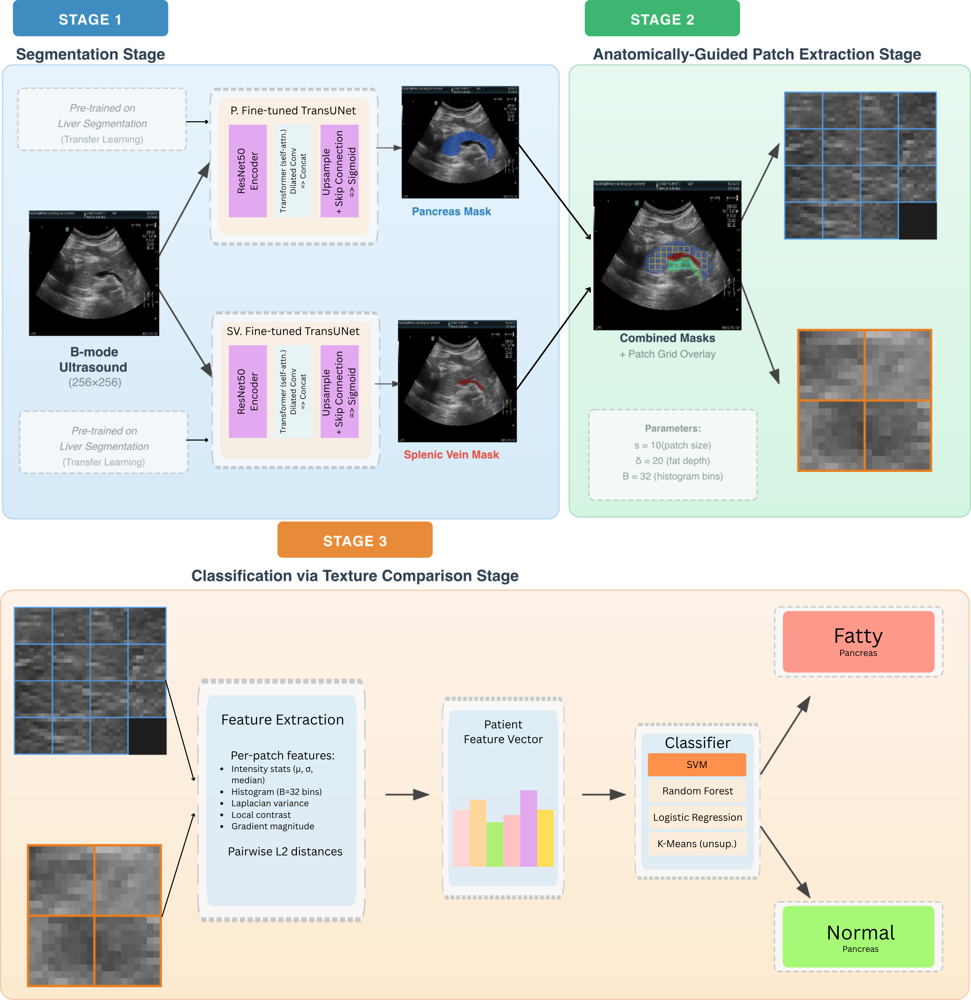
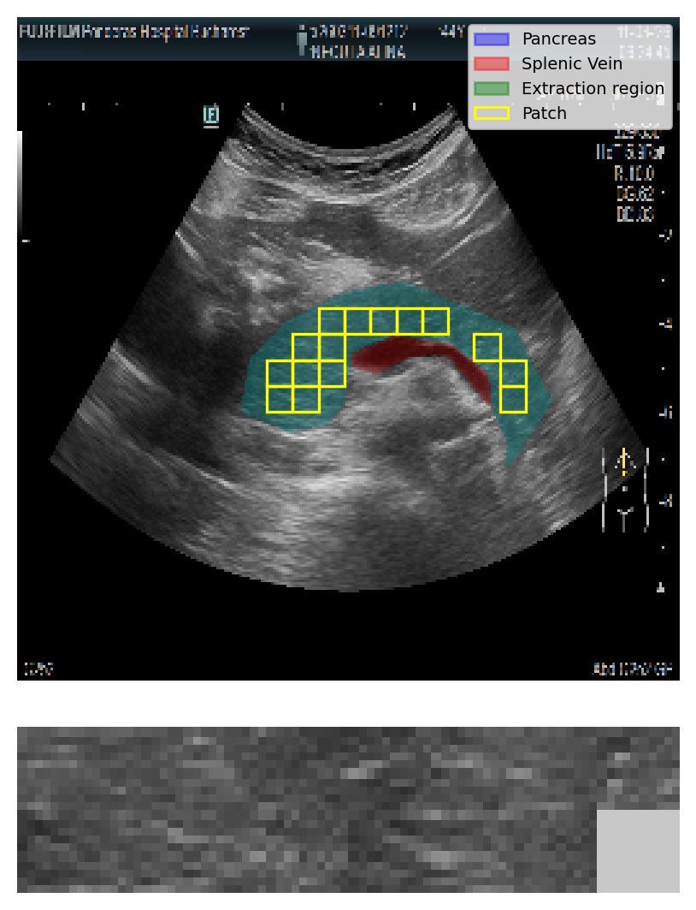
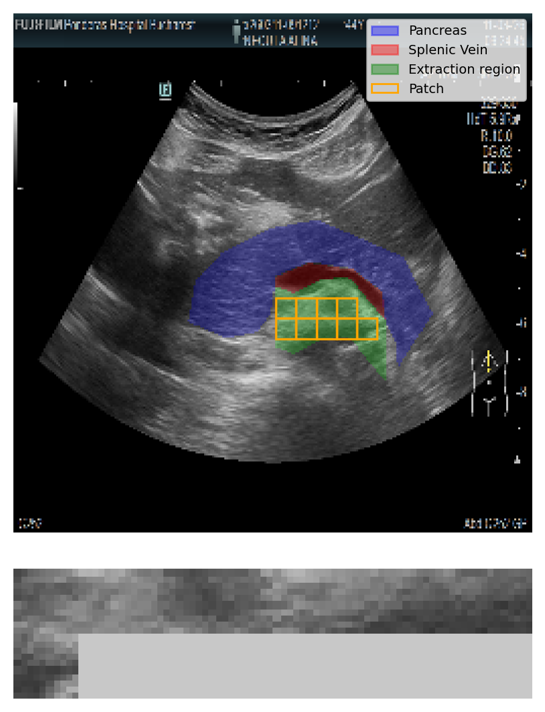
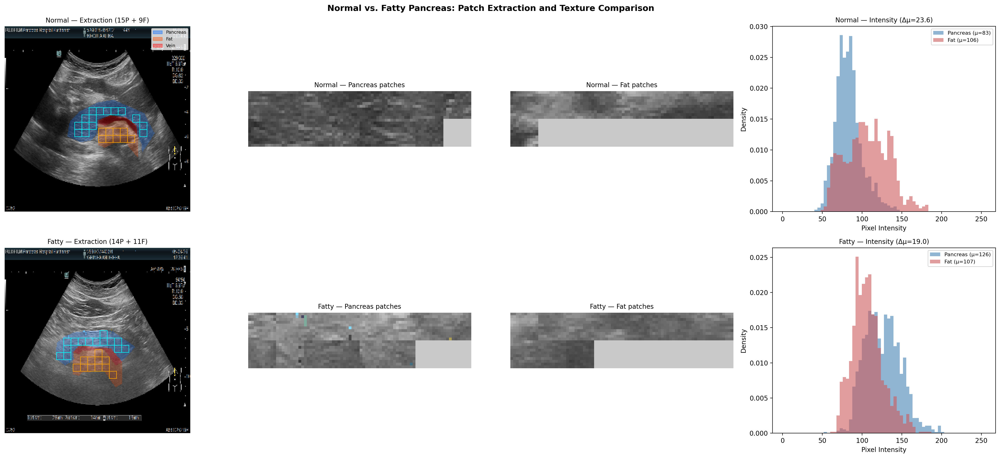
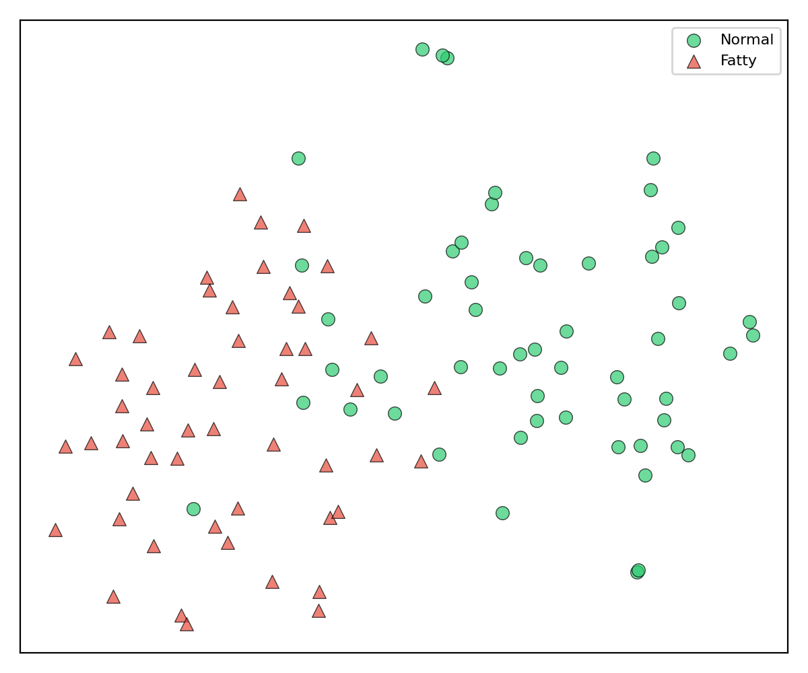
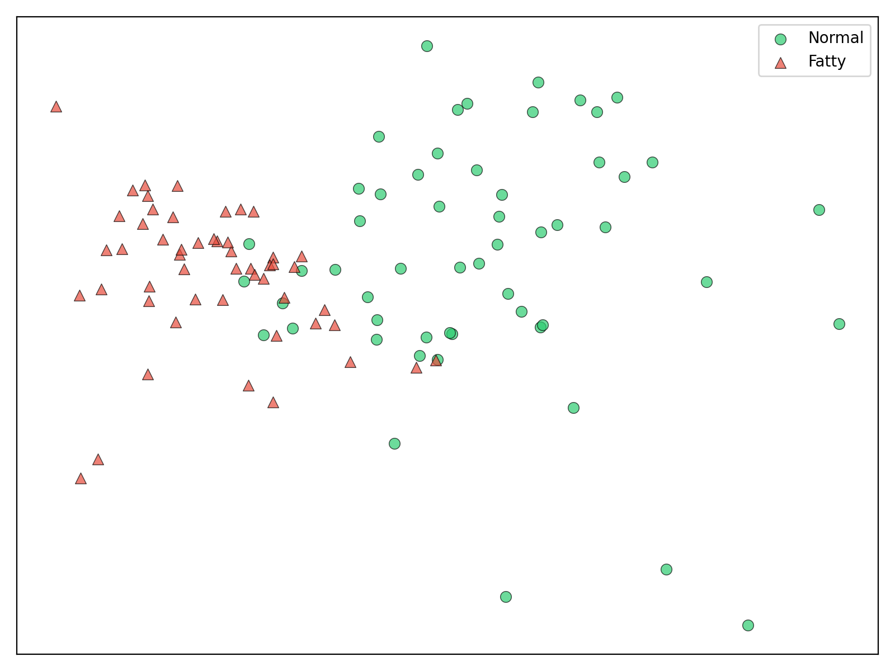

# A Unified Framework for the Detection and Classification of Fatty Pancreas in Ultrasound Images

An end-to-end automated pipeline for detecting and classifying non-alcoholic fatty pancreas disease (NAFPD) from B-mode abdominal ultrasound images.

## Pipeline Overview

The framework consists of three stages: (1) segmentation of the pancreas and splenic vein using TransUNet, (2) anatomically-guided patch extraction from segmented regions, and (3) patient-level classification via texture comparison.



## Patch Extraction

Tissue patches are extracted from two anatomically relevant regions: the pancreas parenchyma and the fat region below the splenic vein. Per-patch features (intensity statistics, histogram, Laplacian variance, local contrast, gradient magnitude) are computed and compared via pairwise L2 distances to form a 46-dimensional patient-level feature vector.

<p align="center">
  
  
</p>

## Normal vs. Fatty Pancreas

The method mimics clinical assessment: in normal patients, pancreas and fat tissue have distinct echogenicity profiles, while in fatty patients these profiles overlap due to fat infiltration.



## Results

Evaluated on 214 ultrasound images (107 cases, 55 normal / 53 fatty) using 5-fold stratified cross-validation with independent segmentation retraining per fold.

| Method | Accuracy | F1 | Cohen's kappa |
|--------|----------|----|---------------|
| **SVM (RBF)** | **89.7% +/- 1.8%** | **0.898 +/- 0.019** | **0.794 +/- 0.036** |
| K-Means (unsupervised) | 87.8% +/- 1.4% | 0.879 +/- 0.013 | 0.757 +/- 0.028 |
| Random Forest | 87.8% +/- 3.5% | 0.879 +/- 0.034 | 0.757 +/- 0.070 |
| Gradient Boosting | 85.0% +/- 2.4% | 0.848 +/- 0.025 | 0.700 +/- 0.048 |

Segmentation: Pancreas Dice 0.712 +/- 0.018, Splenic Vein Dice 0.699 +/- 0.071.

<p align="center">
  
  
</p>

*t-SNE (left) and PCA (right) projections of patient features show clear separation between normal and fatty cases.*

## Requirements

- Python 3.8+
- PyTorch 1.9+
- NumPy, OpenCV, Albumentations, Pillow

```bash
pip install torch torchvision albumentations opencv-python pillow numpy
```

## Usage

```bash
# Train segmentation models
python train.py

# Run the full end-to-end pipeline
python pipeline.py

# Evaluate classification
python fine_tune_combined.py

# Test
python test.py
```

## Project Structure

- `model.py` - TransUNet architecture (ResNet50 encoder + Transformer bottleneck)
- `resnet.py` - ResNet encoder
- `train.py` - Segmentation training
- `fine_tune.py` / `fine_tune_combined.py` - Model fine-tuning
- `pipeline.py` - End-to-end pipeline orchestration
- `test.py` / `test_combined.py` - Evaluation scripts
- `metrics.py` - Loss functions and metrics
- `utils.py` - Utility functions

## Citation

[Citation information for double-blind review]
